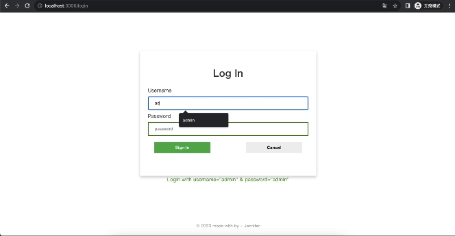
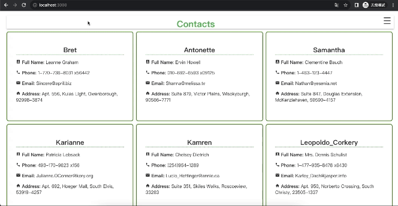
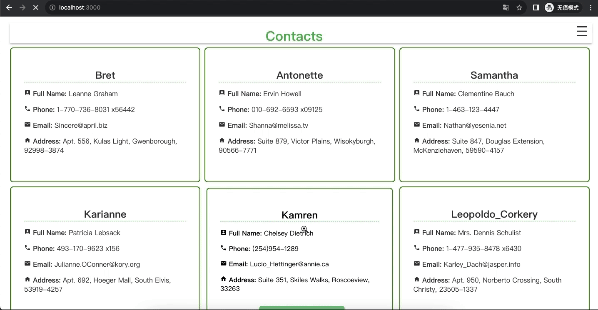
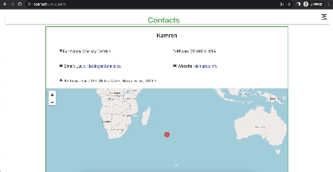

# Contacts Application 
<p style="text-align:right">by Jueying Huang (Jennifer) on August 23th, 2023</p>

- #### [Features](#1)
- #### [Deployment](#2)

<h2 id="1"> Features </h2>

### 1. Log In
Log In with: `username="admin" & password="admin"`


---

### 2. View All Contacts
Data from: `https://jsonplaceholder.typicode.com/users`


---

### 3. View Contact Detail Information
Data from: `https://jsonplaceholder.typicode.com/users/user_id`


---

### 4. Navigate
Link to: `Home, Profile and Logout`


---


<h2 id="2"> Deployment<h2>

```npm start```

OR

```docker-compose -f docker-compose.dev.yml up```